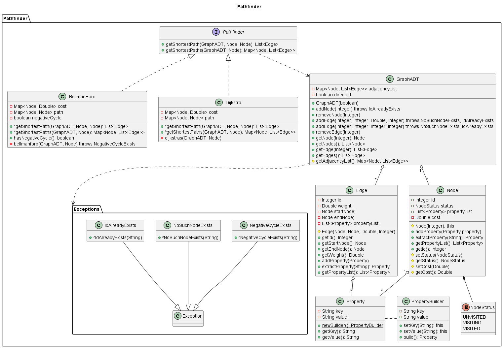

# Pathfinder

This is a library to create graphs and use pathfinding algorithms on them.

## UML Diagram of Library



## Graph ADT Methods
| Method | Return | Explanation | Complexity | Exceptions |
|:--:|---------------|------|-------|-----|
| addNode(id) | - | Adds a node with Integer id. | O(1) | if another node already has the id: IdAlreadyExists |
| addEdge(n1, n2, weight, id) | - | Adds a directed edge between n1 and n2, or undirected if the graph is undirected. The edge is given the weight and id. | O(1) | if another edge already has the id: IdAlreadyExists. if the given node ids don't associate to an existing node: NoSuchNodeExists |
| removeNode(id) | - | Removes the given node from the adjacency list | O(\|E\|) | - |
| removeEdge(id) | - | Removes the given edge from the adjacency list | O(\|E\|) | - |
| getNode(id) | Node | Get the node with given id | O(\|N\|) | - |
| getNodes() | List<Node> | Get all nodes in the graph | O(\|N\|) | - |
| getEdge(id) | List<Edge> | Get list of edges with the given id. Will return a list with 1 element in a DiGraph and 2 elements in a UnDiGraph. | O(\|E\|) | - |
| getEdges() | List<Edge> | Get all nodes in the graph | O(\|E\|) | - |

## Pathfinder Methods

### Dijkstras
| Method | Return | Explanation | Complexity | Exceptions |
|:--:|---------------|------|-------|-----|
| getShortestPath(graph, startNode, destinationNode) | List<Edge> | Get the shortest path from the source node to the destination node | O(\|N\| + \|E\|) |  |
| getShortestPaths(graph, startNode) | Map<Node, List<Edge>> | Get all shortest paths from the source node all other nodes | O(\|N\| + \|E\|) |  |

### BellmanFord
| Method | Return | Explanation | Complexity | Exceptions |
|:--:|---------------|------|-------|-----|
| getShortestPath(graph, startNode, destinationNode) | List<Edge> | Get the shortest path from the source node to the destination node | O(\|N\|\|E\|) |  |
| getShortestPaths(graph, startNode) | Map<Node, List<Edge>> | Get all shortest paths from the source node all other nodes | O(\|N\|\|E\|) |  |
| hasNegativeCycle() | boolean | Return true if there is a negative cycle after computing a shortest path | O(1) |  |


#### Populate your graph

```java
public static void main(String[] args) {
    GraphADT graph = new GraphADT(false);   // undirected graph
    try {
        graph.addNode(0);
        graph.addNode(1);
        graph.addNode(2);
    
        graph.addEdge(0, 1, 9, 0);
        graph.addEdge(0, 2, 12, 1);
    } catch (NoSuchNodeExists | IdAlreadyExists e) {
        System.out.println(e.getMessage());
    }

    System.out.println(graph);
}
```

**Output of the above code:**

    GraphADT {
        adjacencyList=
            Node{id=1, status=UNVISITED} -> [Edge{id=0, weight=9.0, startNode=Node{id=1, status=UNVISITED}, endNode=Node{id=0, status=UNVISITED}}],
            Node{id=2, status=UNVISITED} -> [Edge{id=1, weight=12.0, startNode=Node{id=2, status=UNVISITED}, endNode=Node{id=0, status=UNVISITED}}],
            Node{id=0, status=UNVISITED} -> [Edge{id=0, weight=9.0, startNode=Node{id=0, status=UNVISITED}, endNode=Node{id=1, status=UNVISITED}}, Edge{id=1, weight=12.0, startNode=Node{id=0, status=UNVISITED}, endNode=Node{id=2, status=UNVISITED}}],
        directed=false
    }

